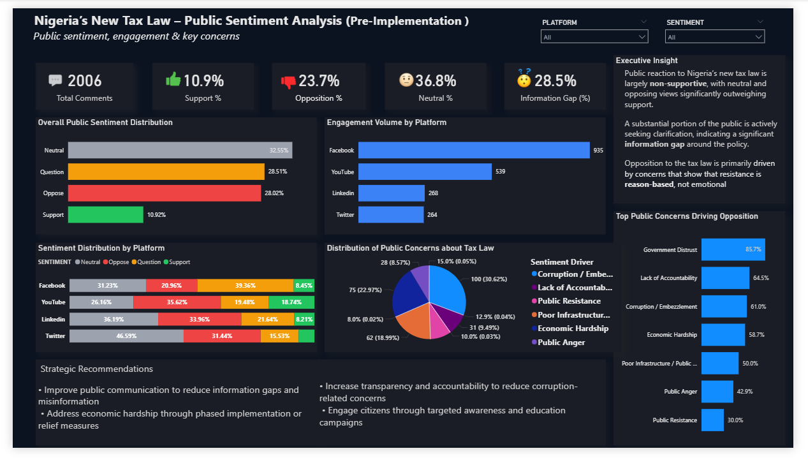

# 📊 Public Reaction to Nigeria’s New Tax Law

## 📝 Overview
This project analyzes public sentiment toward Nigeria’s new tax law using social media comments from platforms such as Facebook, Twitter (X), YouTube, and LinkedIn.

The goal is to understand how Nigerians perceive the policy before its implementation in January 2026.

---

## 📌 Objectives
- Analyze public sentiment (Support, Opposition, Neutral, Clarification)
- Identify key drivers of opposition
- Measure engagement across platforms
- Highlight gaps in public understanding of the tax law

---

## 📷 Dashboard Preview
A high-level view of public sentiment, engagement patterns, and key concerns:

  

---

## 📊 Key Insights
- Public sentiment is largely non-supportive, with opposition and neutral views dominating
- A significant portion of users are seeking clarification, indicating an information gap
- Opposition is primarily driven by concerns about corruption, economic hardship, and poor public services
- Facebook and Youtube show the highest levels of engagement, making them key platforms for public discourse

---

## 🛠 Tools Used
- Power BI (Data visualization & dashboarding)
- Power Query (Data cleaning & transformation)
- DAX (Data modeling & calculations)
- Excel/CSV (Data source)
- GitHub (Project hosting)
- Apify (YouTube, Facebook, LinkedIn, Twitter), Manual Web Scraping
---

## 📁 Project Files

- 📊 [Download Power BI Dashboard](tax_sentiment_dashboard.pbix)
- 📁 [Download Main Dataset](nigeria-tax-law-dataset.xlsx)
- 🗂️ [Download Structured Twitter Data](twitter_comments_structured.xlsx)

---

## 📈 Key Metrics
- Total Comments
- Support %
- Opposition %
- Neutral %
- Clarity Gap %

---

## 📍 Conclusion
The analysis reveals both a trust gap and a communication gap between the government and the public. Addressing transparency concerns and improving policy communication will be critical for successful implementation.
